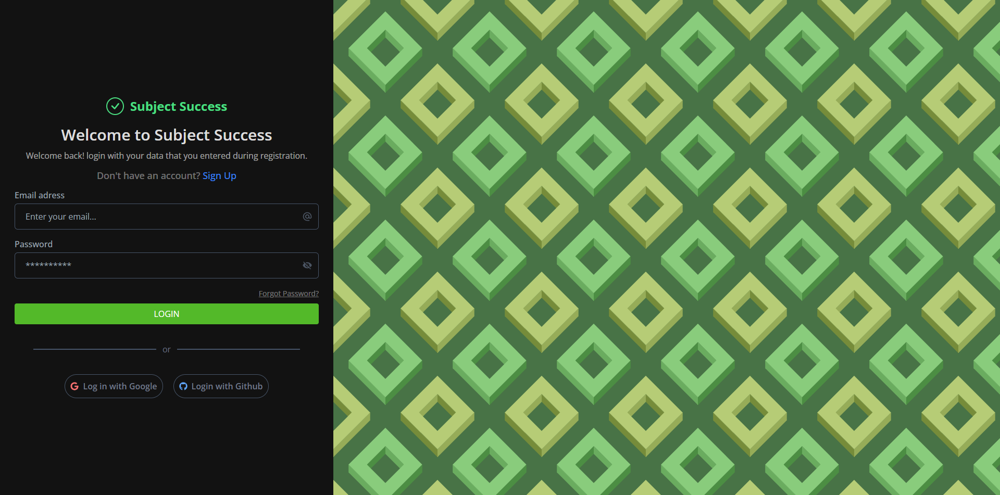
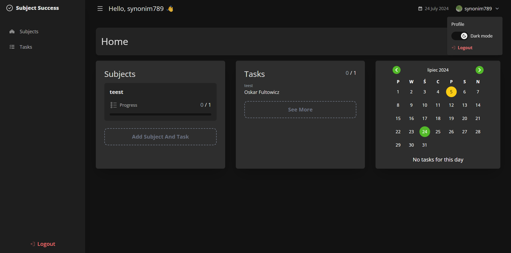

# Subject Success Frontend

This is <span>Subject Success</span> a web app when you cann add school subject and the task you need to do to pass them.

## [Link to page](https://subject-success.vercel.app/)





## 🚀 Quick Start

1. Clone the backend repo

```
git clone https://github.com/synonim789/subject-success-api
```

2. Install NPM packages for backend

```
cd subject-success-api
npm install
```

3. Create .env file and add necessary secrets like this:

```
GOOGLE_CLIENT_ID= google auth client id
GOOGLE_CLIENT_SECRET= google auth secret
GOOGLE_REDIRECT_URL=url to auth google of the backend

GITHUB_CLIENT_ID= id of github auth
GITHUB_CLIENT_SECRET= secret of github auth

MAILTRAP_USER=username from mailtrap service
MAILTRAP_PASSWORD=password from mailtrap service

CLOUDINARY_CLOUD_NAME=name of cloudinary cloud
CLOUDINARY_API_KEY=api key of cloudinary cloud
CLOUDINARY_API_SECRET=secret of cloudinary cloud
```

4. Run the backend

```
npm run dev
```

5. Clone the frontend repo

```
cd ..
git clone https://github.com/synonim789/subject-success-frontend
```

6. Install NPM packages for frontend

```
cd subject-success-frontend
npm install
```

7. Create .env.local file and add necessary secrets like this:

```
VITE_GOOGLE_CLIENT_ID= google auth client id
VITE_GOOGLE_REDIRECT_URL= redirect url to backend google auth

VITE_GITHUB_CLIENT_ID= client id of github auth
VITE_GITHUB_REDIRECT_URL= redirect url to backend github auth

VITE_BACKEND_SERVER_URL= url to server
```

8. Run the frontend

```
npm run dev
```

9. The app will launch at localhost:5173